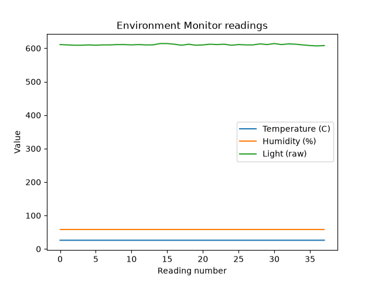
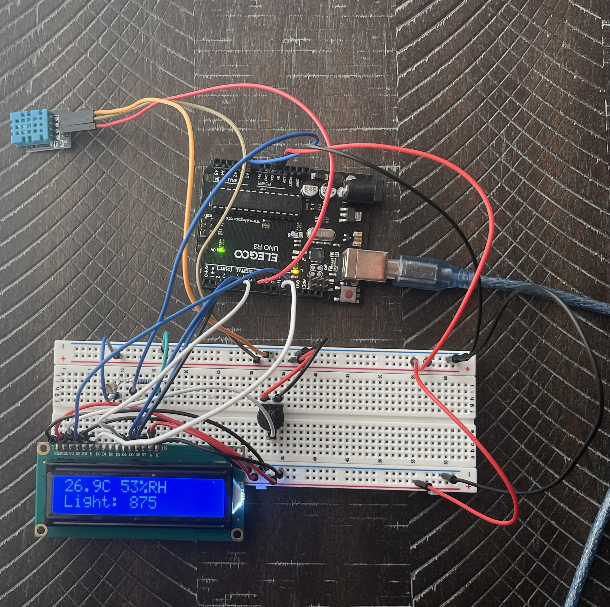

# Environment Monitor

An Arduino based data logger that reads environmental data like temperature, humidity and ambient light level. It physically displays the live data on an LCD (LCD1602). It is also streaming them over serial to a Python logger that collects every reading, attaches a time stamp to it and sends it to a CSV (excel) which is then plotted.

*The data collected spans about three and a half hours across sunset. It is logged at 0.5hz (one cycle every 2 seconds). We can see that the natural light level went down from full saturation to near total-darkness, temperature dropped similarly while humidity went up inversely.*

## What it does

The system consists of two parts that communicate over a USB cable.

**The Arduino:** A DHT11 temperature and humidity module, reports the temperature and relative humidity while a photoresistor in a voltage divider circuit system reports light as a raw 0 - 1023 ADC value, representing the voltage level on the analog pin. Readings, collected every 2 seconds, are shown live on the LCD1602 for humans and emitted as CSV over UART for a computer.

**On the PC:** A python script receives on the serial port, validating each line, attaching a time stamp and adding to a CSV. There is a second script that reads that same CSV and plots all 3

## Hardware

| Component | Purpose | Connection |

| Elegoo Uno R3 | Controller |  |
| DHT11 | Collect temperature + relative humidity | Digital pin 7 |
| Photoresistor + 10 kΩ resistor | Collect light level with the voltage divider | Analog pin A0 |
| LCD1602 (parallel, 4-bit mode) | Live display | Digital pins 12, 11, 5, 4, 3, 2 |
| 10k potentiometer | Adjust LCD contrast | LCD V0 |

The LCD runs in 4-bit mode, so pins D0-D3 are not connected. This lowers the amount of Arduino pins, but each byte must be sent in two parts (each 8-bit byte transmitted as two 4-bit nibbles.)

## Software

| File | Purpose |

| `arduino/environment_monitor-/Environment_monitor.ino` | Handles the sensor readings, LCD output, emits serial CSV |
| `python/logger.py` | Serial reader, validator, CSV writer |
| `python/plot_data.py` | Reads the CSV, plots and creates readings.png |
| `python/sampledata.csv` | Data from the run |

**Libraries :** pyserial and **matplotlib** on the Python side. The **Adafruit DHT sensor library** and the built-in LiquidCrystal on the Arduino side.

## Running it

1. The circuit should be wired first as the hardware table above describes
2. Upload the Environment_monitor.ino sketch.
3. Set the PORT in `logger.py` to match your board's serial port
4. Make sure Arduino IDE's Serial Monitor is closed (Ensure only one process holds the port)
5. `python logger.py` logs to sensordata.csv, stop reading with Ctrl + C
6. `python plot_data.py` generates your readings.png

## Design decisions and why:

**Two output formats for two receivers**: The LCD gets rounded, values get labelled for a human looking at it. The serial line however gets raw CSV like 22.50,43.00,513 so the computer side can process it directly without having to modify it for every reading.

**Timestamps come from the computer side, not the Arduino:** The Elegoo Uno has no clock or storage. It knows two seconds have passed but doesn't know the clock time or where to put an hour of history. That constraint is why the Python half comes into play.

**Serial input is not left unvalidated:** UART data can be messy, mostly right after the port opens, this is when something like a partial line can happen. The logger gets rid of any line that doesn't fit into exactly three fields or if the fields don't parse as numbers. This is better than crashing on them. This really matters over a longer run to ensure a complete dataset and preventing the run from ending a couple seconds in.

**Separate scripts for collection and visualization:** We have two programs that share a file. The plotting script had to be written twice to add subplots and to switch the x axis to real time all without having to recollect a single reading.

## What the data shows

**Humidity is inversely correlated with temperature :** The two lines are very similar. The DHT11 measures relative humidity, and cool air holds less moisture so as the room cooled down, the same water in the air read as a higher percentage. The rise is mostly temperature, not moisture.

**The light sensor maxes out in daylight :** Before sunset, the readings sit near 990 out of 1023, so bright and "very bright" look the same and aren't differentiable. The 10 kΩ resistor puts the useful range at the dimmer end as no single value covers both a window with a shining sun and a dark night.
